If you like what I make, you can buy me a coffee:

  

 

### ✦ The Spin

> *"Nyo hō~"*

I'm **apollosense** — a vibecoder, learning HTML and stuff related to that.

I make small web things for fun. Most of them start as a detour and end up being the shortest path.

 

### ✦ Featured Projects

<!-- To feature another repo, copy the <a>…</a> block above and change both repo names. -->

ゴ ゴ ゴ &nbsp;·&nbsp; arrivederci &nbsp;·&nbsp; ゴ ゴ ゴ

